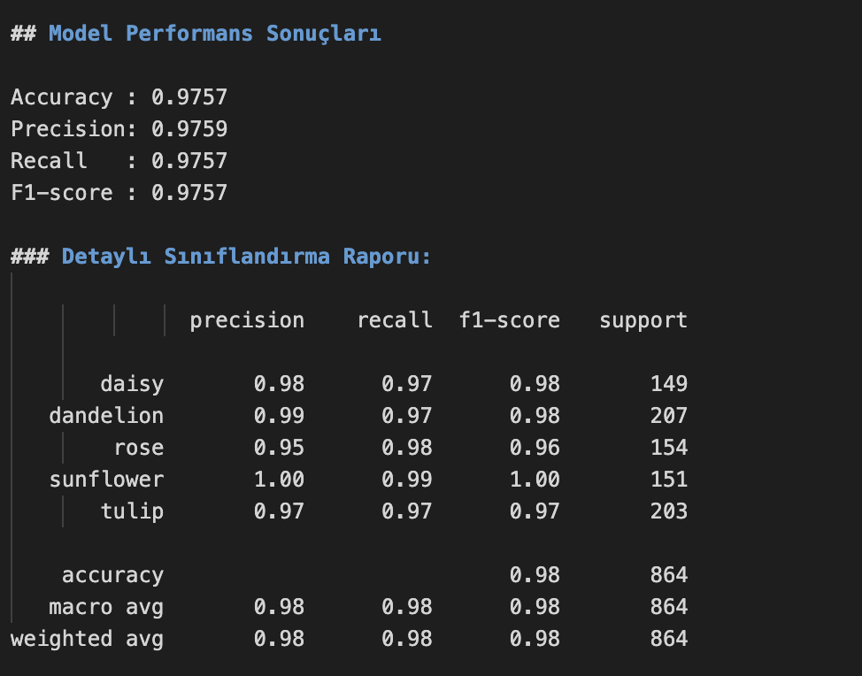

# Sektör Kampüste 2025-226 Güz Dönemi 
Yapay Zeka ve Bulut Bilişim Teknolojileri 
Proje Ödevi

Hazırlayan : Elif Beyza Beyaz 220502033

# 🌸 Çiçek Sınıflandırma Web Uygulaması (ViT)

Bu proje, **Vision Transformer (ViT)** tabanlı bir derin öğrenme modeli
kullanarak çiçek görüntülerinin sınıflandırılmasını sağlayan
**web tabanlı bir uygulamadır**.  
Kullanıcılar bilgisayarlarından bir görüntü yükleyerek modelin tahmin
sonucunu ve güven oranını görüntüleyebilir.

---

## Özellikler

- Bilgisayardan görüntü yükleme  
- Yüklenen görüntünün ekranda gösterilmesi  
- Otomatik görüntü ön işleme (yeniden boyutlandırma, kırpma, normalize)  
- **Tahmin Et** butonu ile sınıflandırma  
- Tahmin edilen sınıf adı ve güven oranı  
- Sınıf olasılıklarının grafik ve tablo halinde sunulması  

---

## Sınıflar

Model aşağıdaki çiçek türlerini sınıflandırmaktadır:

- Daisy  
- Dandelion  
- Rose  
- Sunflower  
- Tulip  

---

## Kullanılan Teknolojiler

- Python 3.10  
- PyTorch  
- Hugging Face Transformers  
- Vision Transformer (ViT)  
- Streamlit  (arayüz)
- Scikit-learn

## Model Sonuç 

## Uygulama ekran görüntüleri

### Görüntü Yükleme Ekranı

### Tahmin Et Butonu

### Sonuç Ekranı

## ▶ Uygulamayı Çalıştırma

pip install streamlit torch transformers pillow pandas
python3.10 -m streamlit run app.py

## Uygulama Ekran Kaydı ve Eğitilmiş Modelim
https://drive.google.com/drive/folders/1_D9aKdE6-7hXVYYnEJ_4rzKN9qeOY8rb?usp=sharing

